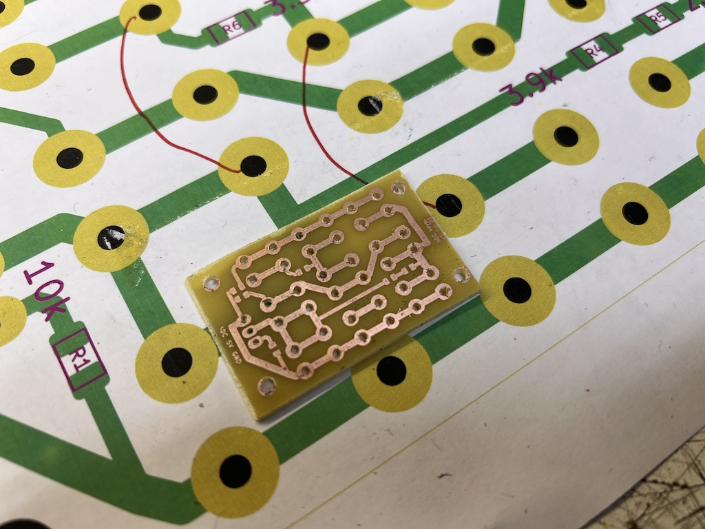

# ADC based keypad

This is a 3-wires ADC based 3x3 keypad. Only 3 pins Vcc-GND-ADC.

Ideal to be used with salvaged silicon buttons from remote controls.
There is a momentary button under silicon cap.



# Code

```

enum KEYPAD_BUTTONS
{
    BTN_NOT_PRESSED, // 0
    BTN_TOP_LEFT,    // 1
    BTN_UP,          // 2
    BTN_TOP_RIGHT,   // 3
    BTN_LEFT,        // 4
    BTN_CENTER,      // 5
    BTN_RIGHT,       // 6
    BTN_BACK,        // 7
    BTN_DOWN,        // 8
    BTN_MENU         // 9
};
const char *buttonsNames[] = {"NOT PRESSED", "BTN_TOP_LEFT", "BTN_UP", "BTN_TOP_RIGHT", "BTN_LEFT", "BTN_CENTER", "BTN_RIGHT", "BTN_BACK", "BTN_DOWN", "BTN_MENU"};
KEYPAD_BUTTONS prev_button_pressed = BTN_NOT_PRESSED;


byte read_buttons()
{
    int voltage = analogRead(A0);
    KEYPAD_BUTTONS result = BTN_NOT_PRESSED;
    KEYPAD_BUTTONS new_button_pressed = BTN_NOT_PRESSED;
    if (voltage >= 540 && voltage <= 590) // 558
        new_button_pressed = BTN_MENU;
    else if (voltage >= 650 && voltage < 670) // 655
        new_button_pressed = BTN_DOWN;
    else if (voltage >= 800 && voltage <= 845) // 825
        new_button_pressed = BTN_BACK;
    else if (voltage >= 580 && voltage <= 615) // 596
        new_button_pressed = BTN_RIGHT;
    else if (voltage >= 700 && voltage <= 725) // 708
        new_button_pressed = BTN_CENTER;
    else if (voltage >= 890 && voltage <= 940) // 912
        new_button_pressed = BTN_LEFT;
    else if (voltage >= 620 && voltage <= 640) // 631
        new_button_pressed = BTN_TOP_RIGHT;
    else if (voltage >= 740 && voltage <= 775) // 759
        new_button_pressed = BTN_UP;
    else if (voltage >= 980 && voltage <= 1023) // 1000
        new_button_pressed = BTN_TOP_LEFT;

    if (new_button_pressed == BTN_NOT_PRESSED && prev_button_pressed != BTN_NOT_PRESSED)
    {
        // button was released
        result = prev_button_pressed;
        prev_button_pressed = BTN_NOT_PRESSED;
    }
    else if (new_button_pressed != BTN_NOT_PRESSED && prev_button_pressed == BTN_NOT_PRESSED)
    {
        // button was pressed
        prev_button_pressed = new_button_pressed;
    }
    return result;
}

...


void loop()
{
    byte command = read_buttons();
    if (command != BTN_NOT_PRESSED)
    {
    	...
	}
}
 
 

```

# Notes

Performance seems OK. 

One disadvantage is that you need to alter source code when real ADC values are captured.
Some buttons yeld ADC valus that are very close to each other. I'm concern about long-term reliability.
You need to poll the state periodically, but you don't need to debounce.
